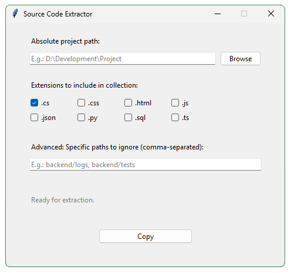

# Source Code Extractor

A desktop utility built with Python that extracts source code from projects and copies it into a structured, AI-friendly format.

Source Code Extractor was designed to simplify the process of sharing project context with AI assistants and LLMs. Instead of manually opening and copying dozens of files, the application scans your project, filters relevant source files, ignores unnecessary directories, and generates a clean output ready to be pasted anywhere.




## ✨ Why Use It?

When working with AI assistants, providing accurate project context is essential.

Source Code Extractor helps you:

* Quickly gather source code from an entire project
* Exclude build artifacts and generated files
* Focus only on relevant file types
* Export everything in a consistent format
* Save time when sharing code with LLMs


## 🚀 Features

### Visual Interface

A simple and intuitive desktop GUI for selecting projects and configuring extraction rules.

### Smart File Filtering

Built-in support for common development file types:

```text
.cs  .css  .html  .js
.json  .py  .sql  .ts
```

### Noise Reduction

Automatically ignores common directories that rarely provide useful context:

```text
.git
.vs
.vscode
node_modules
bin
obj
build
dist
platform
```

### Custom Ignore Rules

Add your own relative paths directly through the interface.

### One-Click Clipboard Export

Extracted files are formatted using clear file headers:

```text
// ==== path/to/file ====
```

The resulting output is automatically copied to your clipboard.


## 🛠 Installation

### Clone the Repository

```bash
git clone https://github.com/TheSampaio/SourceCodeExtractor.git
cd SourceCodeExtractor
```

### Install Dependencies

```bash
pip install -r requirements.txt
```


## ▶️ Running the Application

Launch the application with:

```bash
python src/main.py
```


## 📦 Requirements

* Python 3.x
* pyperclip

Install dependencies using:

```bash
pip install -r requirements.txt
```


## 🖥 Example Workflow

1. Select a project folder
2. Choose which file extensions to include
3. Add any custom ignore rules
4. Click **Extract**
5. Paste the generated output into your AI assistant, documentation, or notes


## 🎨 Built with Kroma

The user interface is powered by **Kroma**, an object-oriented GUI framework built on top of Tkinter.

Kroma simplifies desktop application development by providing a cleaner and more expressive API for creating windows, widgets, layouts, and event-driven interfaces.

### Kroma Highlights

* Object-oriented architecture
* Simplified widget management
* Built-in alignment and styling helpers
* Message box utilities
* Screen information helpers
* Event-driven design

Repository:

https://github.com/TheSampaio/Kroma

> Kroma is open source and distributed under the BSD 2-Clause License.


## 📄 License

This project is licensed under the MIT License.

See the `LICENSE` file for more information.
